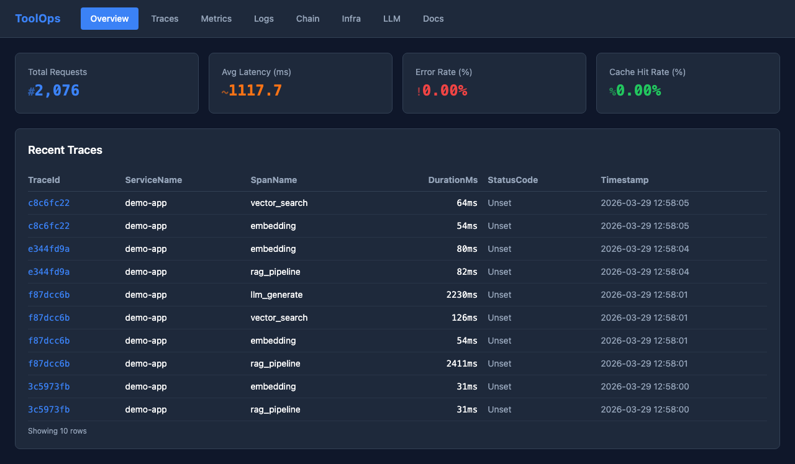
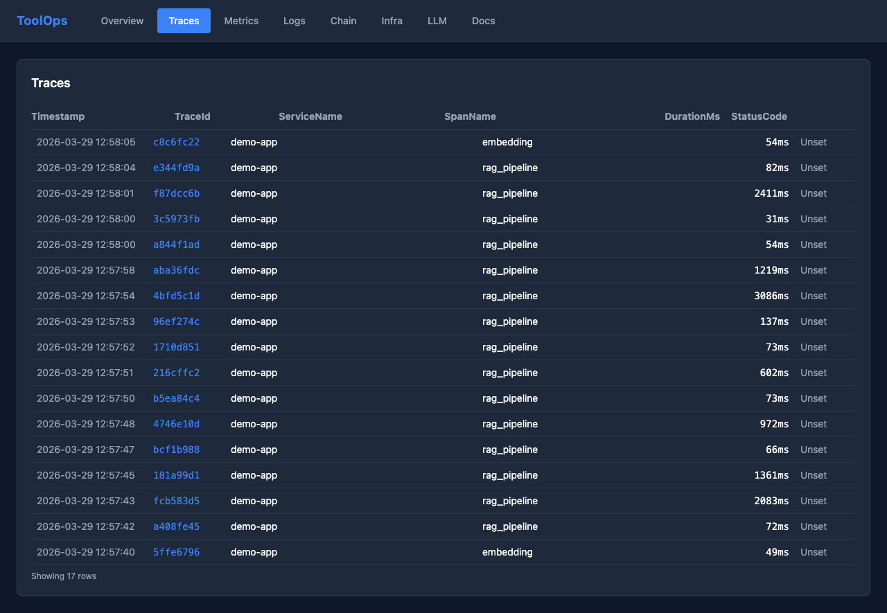
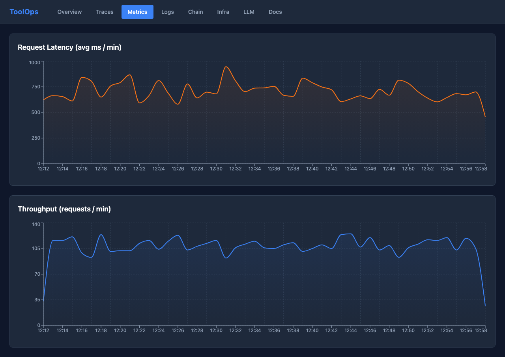
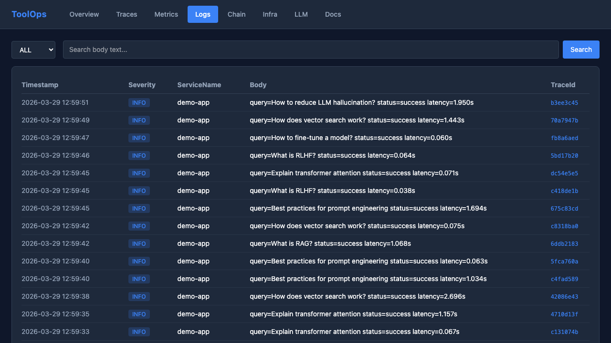
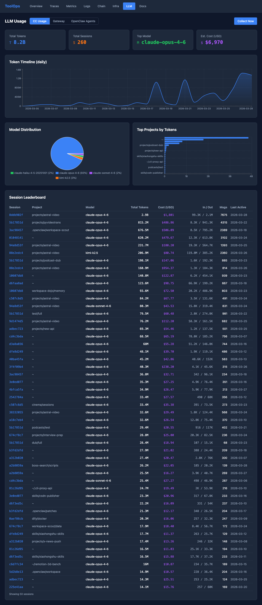
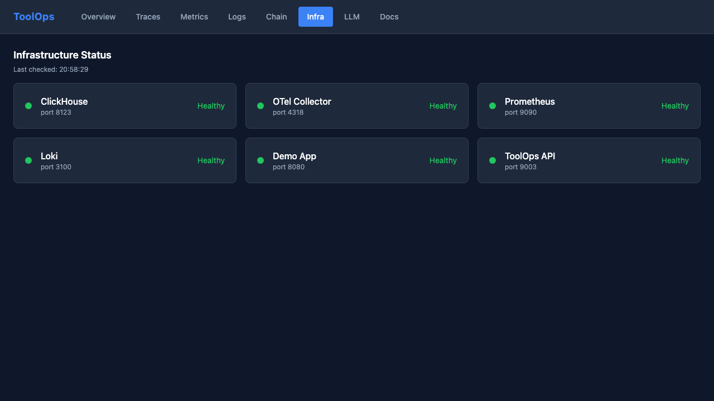

<p align="center">
  <h1 align="center">ToolOps</h1>
  <p align="center"><strong>Protocol-driven AI app ops sidecar — unified app observability + LLM cost intelligence in one platform.</strong></p>
  <p align="center">
    Declare your AI app topology in <code>toolops.yaml</code>. ToolOps wires up traces, metrics, logs, and LLM cost tracking automatically — all correlated by <code>trace_id</code> in a single ClickHouse store.
  </p>
</p>

<p align="center">
  
  
  
  
  
</p>

---



<details>
<summary>More screenshots</summary>

**Traces — distributed tracing with span timeline**


**Metrics — latency & throughput time-series**


**Logs — severity filtering & trace linking**


**LLM Cost Intelligence — CC usage, model distribution, session leaderboard**


**Infrastructure Health — real-time status of all components**


</details>

## Why ToolOps?

Existing observability tools don't fit AI applications well:

| Tool | Problem |
|------|---------|
| **Grafana + Prometheus** | Generic dashboards — no understanding of RAG pipelines, LLM token costs, or embedding latency |
| **LangFuse / LangSmith** | SaaS-first, heavy SDKs, vendor lock-in, no self-hosted infra visibility |
| **Arize Phoenix** | Focused on ML model monitoring, not full-stack app observability |
| **Coolify / Dokploy** | Generic PaaS — no concept of AI app topology (vector store, LLM provider, etc.) |

ToolOps takes a different approach:

- **Protocol-Driven** — Declare your app topology in `toolops.yaml`. ToolOps understands roles (api-gateway, vector-store, llm-provider) and adapts monitoring accordingly.
- **Unified Storage** — Traces, metrics, and logs all land in ClickHouse. One `trace_id` connects everything — no jumping between 3 different tools.
- **AI-Native Dashboard** — Purpose-built views for RAG pipeline analysis, LLM token tracking, and embedding performance.

## Features

- **Real-time Overview** — Request count, avg latency, error rate, cache hit ratio at a glance
- **Distributed Tracing** — Full RAG pipeline visibility (embedding → retrieval → generation), each step as a span
- **Metrics Dashboard** — Latency and throughput time-series charts from ClickHouse-aggregated OTel data
- **Structured Logs** — Severity filtering, full-text search, TraceId linking to call chains
- **Cross-Signal Correlation** — Enter a trace_id → see spans + logs + metrics in one view
- **Infrastructure Health** — Auto-refreshing health cards for all stack components
- **Built-in Docs** — Markdown documentation viewer with dark theme typography
- **LLM Cost Intelligence** — CC usage tracking (52K+ records), Gateway proxy with TTFB metrics, OpenClaw plugin for 12-agent monitoring
- **Unified Query Filters** — Time range, agent, session, and model filtering across all LLM data sources
- **toolops.yaml topology spec** — Declare app topology with semantic roles (api-gateway, vector-store, llm-provider)
- **Docker one-command deployment** — 8 containers including nginx-served production frontend

## Architecture

```
┌──────────────────────────────────────────────────────────────────┐
│  Layer 5: LLM Intelligence                                       │
│  CC Log Collector  │  LLM Gateway Proxy (:9010)                  │
│  OpenClaw Observer Plugin (native llm_input/llm_output hooks)    │
├──────────────────────────────────────────────────────────────────┤
│  Layer 4: Visualization — React Dashboard (nginx, port 3003)     │
│  Overview / Traces / Metrics / Logs / Chain / Infra / Docs       │
│  + LLM: CC Usage / Gateway / OpenClaw Agents  (10 pages total)   │
├──────────────────────────────────────────────────────────────────┤
│  Layer 3: Storage — ClickHouse unified                           │
│  traces / logs / otel_metrics / llm_usage / llm_gateway          │
│  llm_openclaw  — MergeTree + TTL 30d + cross-JOIN by trace_id    │
├──────────────────────────────────────────────────────────────────┤
│  Layer 2: Collection                                             │
│  OTel Collector (:4317/:4318)  │  Prometheus (:9090)  │  Loki (:3100) │
├──────────────────────────────────────────────────────────────────┤
│  Layer 1: Deploy — (coming soon)                                 │
└──────────────────────────────────────────────────────────────────┘
```

**Data flows:**
- **Traces:** App (OTel SDK) → OTLP gRPC → Collector → ClickHouse
- **Metrics:** App (prometheus_client) → Prometheus pull + OTel → ClickHouse
- **Logs:** App (OTel Logs SDK) → OTLP gRPC → Collector → ClickHouse
- **LLM Usage:** CC log files → CC Log Collector → ClickHouse `llm_usage`
- **LLM Gateway:** Client → LLM Gateway Proxy (:9010) → upstream LLM → ClickHouse `llm_gateway`
- **LLM OpenClaw:** Agent hooks (llm_input/llm_output) → OpenClaw Plugin → ClickHouse `llm_openclaw`

## Quick Start

**Prerequisites:** Docker, Docker Compose

```bash
# 1. Clone and start the full stack (8 containers including nginx frontend)
git clone https://github.com/toolmanlab/toolops.git
cd toolops
docker compose up -d

# 2. Open the dashboard
open http://localhost:3003
```

The demo app starts automatically and generates ~1-5 requests/second with simulated RAG pipeline traces.

**Dev mode** (hot-reload frontend, requires Node.js 20+):

```bash
cd frontend && npm install && npm run dev
open http://localhost:5173
```

## Tech Stack

| Layer | Technology | Purpose |
|-------|-----------|---------|
| Frontend | React 19, Vite 8, TypeScript, Tailwind CSS 4, recharts | Dashboard UI |
| Frontend Serving | nginx | Production static file serving + API reverse proxy |
| Backend | FastAPI, Python 3.13, clickhouse-connect | API server |
| Storage | ClickHouse 24 | Unified metrics/traces/logs/LLM cost data |
| Collection | OpenTelemetry Collector, Prometheus, Loki | Telemetry ingestion |
| LLM Intelligence | CC Log Collector (Python), LLM Gateway Proxy (Python) | LLM cost tracking |
| OpenClaw Plugin | TypeScript | Native llm_input/llm_output hooks for agent monitoring |
| Demo | FastAPI, OTel Python SDK, prometheus_client | Simulated RAG app |

## Port Map

| Service | Host Port | Notes |
|---------|-----------|-------|
| ClickHouse HTTP | 8123 | Query interface |
| ClickHouse Native | 9002 | Remapped from 9000 |
| OTel Collector gRPC | 4317 | OTLP traces/metrics/logs |
| OTel Collector HTTP | 4318 | OTLP HTTP alternative |
| Prometheus | 9090 | Metrics scraping |
| Loki | 3100 | Log aggregation |
| Demo App | 8081 | RAG simulator |
| ToolOps API | 9003 | FastAPI backend |
| LLM Gateway | 9010 | Transparent reverse proxy |
| Dashboard | 3003 | nginx + React (production) |
| Dashboard | 5173 | Vite dev server |

## Documentation

Full documentation is available in the built-in Docs page at `http://localhost:3003/docs`, covering:

- [Project Introduction](frontend/public/docs/introduction.md)
- [Architecture Overview](frontend/public/docs/architecture.md)
- [Data Collection Layer](frontend/public/docs/collector.md)
- [Storage Layer](frontend/public/docs/storage.md)
- [API Reference](frontend/public/docs/api.md)
- [Frontend Pages](frontend/public/docs/frontend.md)
- [Demo App Design](frontend/public/docs/demo-app.md)
- [Deployment Guide](frontend/public/docs/deployment.md)
- [Configuration Reference](frontend/public/docs/configuration.md)

## Project Structure

```
toolops/
├── toolops/                 # Backend Python package
│   ├── api/                 # FastAPI routes
│   │   └── routes/          # overview, traces, metrics, logs, correlate, infra, llm
│   ├── collector/           # CC log collector
│   ├── gateway/             # LLM proxy (transparent reverse proxy)
│   ├── pricing/             # LLM cost calculation logic
│   ├── storage/             # ClickHouse client + schema
│   └── config/              # pydantic-settings
├── extensions/
│   └── toolops-observer/    # OpenClaw plugin (TypeScript, llm_input/llm_output hooks)
├── frontend/                # React dashboard
│   ├── src/pages/           # 10 page components (Overview/Traces/Metrics/Logs/Chain/Infra/Docs + LLM x3)
│   ├── public/docs/         # Markdown documentation
│   ├── Dockerfile           # Multi-stage production build
│   └── nginx.conf           # nginx reverse proxy config
├── demo-app/                # Simulated RAG application
│   ├── main.py              # FastAPI + background traffic generator
│   ├── otel_setup.py        # OTel SDK init (traces + logs)
│   └── scenarios.py         # 7 fault scenarios
├── config/                  # Infrastructure configs
│   ├── otel-collector.yaml
│   ├── prometheus.yml
│   └── loki-config.yaml
├── docker-compose.yml       # Full stack orchestration (8 containers)
├── Dockerfile               # toolops-api image
└── pyproject.toml           # Python package config
```

## Fault Scenarios

The demo app supports 7 configurable scenarios via `DEMO_SCENARIO` env var:

| Scenario | Behavior |
|----------|----------|
| `normal` | Baseline — typical latency, 5% retrieval timeout, 3% LLM rate limit |
| `slow_retrieval` | Vector search 0.5-2s latency, 15% timeout rate |
| `llm_rate_limit` | 30% LLM 429 rate limit errors |
| `cache_cold_start` | 0% cache hit — every request hits full pipeline |
| `memory_pressure` | +0.5MB memory per request (leak simulation) |
| `cascade_failure` | Slow retrieval + LLM rate limits combined |
| `cost_spike` | GPT-4o model with 2-4x token consumption |

```bash
DEMO_SCENARIO=cascade_failure docker compose up -d demo-app
```

## Roadmap

- [x] OTel traces → ClickHouse → Dashboard
- [x] Prometheus metrics integration
- [x] OTel logs pipeline with TraceId correlation
- [x] Cross-signal correlation (Chain page)
- [x] Infrastructure health monitoring
- [x] Built-in documentation system
- [x] toolops.yaml topology spec
- [x] LLM cost intelligence (CC collector + Gateway proxy + OpenClaw plugin)
- [x] Unified query filters
- [x] Production Docker build (nginx frontend)
- [x] Test suite (38 unit tests, 74% coverage)
- [ ] Deploy layer
- [x] CI/CD pipeline (GitHub Actions: pytest + ruff + tsc + docker build)
- [x] Dashboard screenshots in README

## License

[MIT](LICENSE)

---

<p align="center">
  <strong>Part of the <a href="https://github.com/toolmanlab">toolmanlab</a> ecosystem</strong><br/>
  <a href="https://github.com/toolmanlab/toolref">ToolRef</a> (RAG Engine) · <strong>ToolOps</strong> (Observability) · <a href="https://github.com/toolmanlab/toolarch">ToolArch</a> (Architecture Analysis)
</p>
